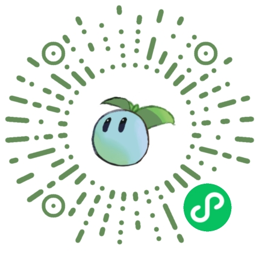
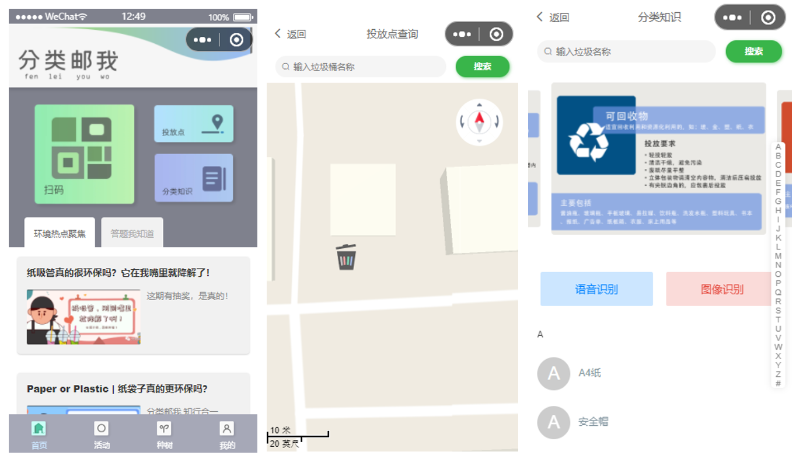
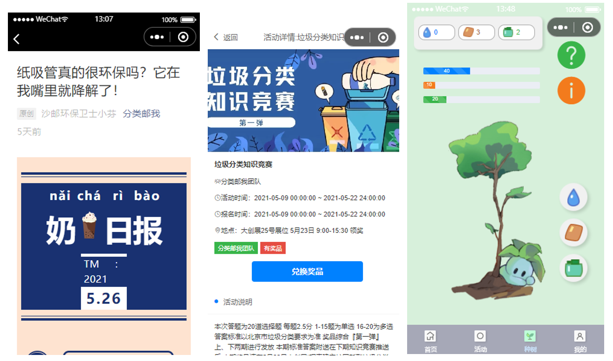

# 分类邮我Campus微信小程序

小程序为北邮学生参加学校大创&互联网+的作品。该小程序获得2021微信小程序应用开发赛全国三等奖、华北赛区一等奖。

## 小程序二维码

（小程序后台资源过期，请求数据已无法显示，敬请谅解）

## 页面展示

图1 首页、投放点页面及分类知识页面

图2 推送详情页面、活动详情页面及种树页面

## 小程序说明

❗❗❗后端资源过期，小程序目前已停止维护。

小程序前端使用ColorUI进行辅助开发。后端包括云开发和nodejs两种方式。

本案例后端使用云开发。目前小程序由于资源过期，已无法正常显示。

* 使用云开发功能包括数据库、CDN（存储树苗GIF图片做前端展示）和云函数。
* 数据库具体命名请在页面发起云数据库请求处查看。
* 云函数功能包括微信登陆请求、调用腾讯云人脸匹配接口、调用阿里云垃圾图像分类接口、和调用阿里云垃圾介绍接口，具体用法请查看云函数文件夹。

nodejs方式后端参考该仓库：https://github.com/charlie0129/waste-sorting-helper-client

小程序制作过程中产生的相关资料：小程序源码、UI设计、产品说明等已上传至网盘

链接：https://pan.baidu.com/s/1HYvFVe217tzb4ZxTJa4q8g 
提取码：kt2b 

感谢各成员在参赛过程中的付出：

队长： 王尔琪 北京邮电大学

后端： 姜洪烨 北京邮电大学

UI： 黄之睿 北京邮电大学

前端： 宁欣宇 北京邮电大学

